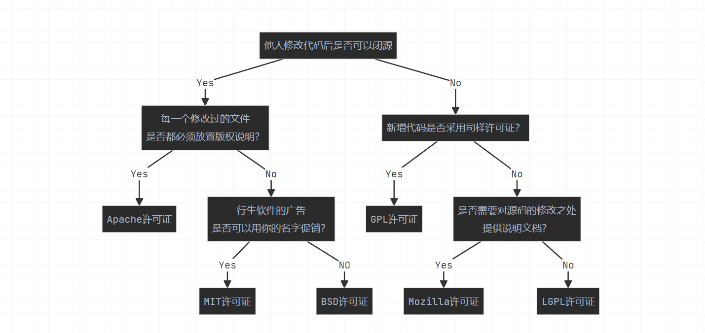

::: tip 前言

在使用浏览仓库时，常常看到许可证。在创建仓库的时候，也会让你选择许可证。那么许可证是什么呢？有点好奇。🤔

:::

## 开源协议

开源协议（也称为开源许可证）是一种规定软件使用、修改和分发的法律条款。它为开源软件提供了一种许可方式，允许任何人自由地使用、修改和分发软件的源代码或二进制文件。

> 可以理解为一种规定，在这种规定的框架中，你可以随意使用开源软件😶

下面分析图更好了解这几种协议：

```mermaid
flowchart TD
    A[他人修改代码后是否可以闭源] -->|Yes| B["每一个修改过的文件<br>是否都必须放置版权说明？"]
    A -->|No| C[" 新增代码是否采用司样许可证？"]
    B -->|Yes| Apache许可证
    B -->|No| D["行生软件的广告<br>是否可以用你的名字促销？"]
    C -->|Yes| GPL许可证
    C -->|No| E["是否需要对源码的修改之处<br>提供说明文档？"]
    D -->|Yes| MIT许可证
    D -->|NO| BSD许可证
    E -->|Yes| Mozilla许可证
    E -->|No| LGPL许可证
```

### 为什么要添加开源协议?

> 知道了开源协议，那为啥要添加呢？有啥好处吗？🤔

- 添加开源协议的主要原因是为了促进软件的共享、可靠性和安全性。要求用户在基于原始作品创建的新作品中保留原来的开源协议。
- 通过添加开源协议，软件作者可以向其他人展示他们的源代码，于吸引更多的贡献者和社区参与进来，共同推动项目的发展。
- 开源协议还可以提高软件的可靠性和安全性，因为任何人都可以查看和审核源代码，发现和修复潜在的漏洞和问题。
- 添加开源协议还可以提高软件的知名度和声誉，因为这表明作者信任其他人对其工作进行贡献和改进，并希望为整个社区做出贡献。

## 协议详解

> 那么协议都有什么呢？有几种？🤔

开源许可证根据限制条件的强弱, 可以分为**强Copyleft许可证**、**弱Copyleft许可证**和**宽松型许可证**。

- **强Copyleft许可证**：要求任何衍生作品都按照原始作品所使用的同一许可证分发并保持开源, 例如「GPL v3」
- **弱Copyleft许可证**：允许衍生作品基于其他许可证分发, 但要保证衍生作品中所使用其授权代码的许可证不做更改并保持开源, 例如「LGPL」，「MPL」
- **宽松许可证**：允许作品中的任意代码基于其他许可证分发, 例如 「BSD」，「MIT」，「Apachev2.0」

:::tip 知识扩展

「Copyleft」是一种用于授权软件的许可证，它允许任何人自由地使用、复制、修改和分发软件及其源代码。

:::

> 现在市面上的开源协议很多，只需了解最流行的六种协议，在使用时会选择即可🧐

### MIT 许可证

> 最宽松的许可证之一。

- 由麻省理工学院创建的许可证。

- 允许任何人以任何目的使用、复制、修改、合并、出版发行、再许可和/或销售软件及其副本。

- 适用于希望尽可能广泛地使用和分享他们的代码的开发者

### Apache 许可证

> 较宽松的许可证，一般用在「Apache软件基金会」的开源项目上。

- 由著名的非盈利组织「Apache软件基金会」发布的。

- 允许任何人复制、修改和重新发布代码，但是要求引用原始版权信息并保留原始许可证和责任声明。
- 适用于需要与专有代码集成的开源项目。

### GNU 通用公共许可证（GPL）

> 最严格的许可证之一。

- 由「Richard Stallman」于1989年编写。是开源许可证中限制条件最严格的许可证之一。

- 要求任何衍生作品都必须使用相同的许可证分发，这被称为“传染性”。
- 适用于希望确保他们的代码被保持开源的开发者。

### BSD 许可证

> 最宽松的许可证之一。

- 由加州大学伯克利分校发表的。BSD许可证是对软件的分发使用的限制条件最为宽松的许可证。

- 允许任何人复制、修改和重新发布代码，甚至可以将代码包含在专有软件中。与MIT许可证类似，但是还包括了对版权的保留。
- 适用于希望尽可能广泛地使用和分享他们的代码，同时想要保护自己的知识产权的开发者。

### Mozilla 公共许可证

> 较严格的许可证，一般用在「Mozilla基金会」的开源项目上。

- 由Mozilla基金会开发并持有的模块级别的开源许可证。

- 具有与 GPL 类似的传染性。任何衍生的作品都必须以 Mozilla 公共许可证进行授权。
- 适用于Web应用程序的开发。

### LGPL 自由软件许可证

> 主要是面向使用C语言以及类C语言。

- 由自由软件基金会公布的接口级别的开源许可证。
- 允许开发者在他们的项目中使用LGPL库文件，而不必将整个项目都采用LGPL协议。

- 如果对LGPL库进行修改，则必须遵循LGPL协议并公开发布这些修改。

- 适用于希望创建具有广泛使用和分发权利的库文件的开发者，同时又想保留一定的控制权，以便在LGPL库文件被其他开发者使用时保护自己的知识产权。

::: tip 宽松程度

GPL > Mozilla > LGPL > Apache > BSD > MIT

:::

### 开源协议表格

> 该表格转载自 [如何为你的代码选择一个开源协议](https://www.cnblogs.com/Wayou/p/how_to_choose_a_license.html)，仅供参考。

| **协议**                                                     | **描述**                                                     | **要求**                       | **允许**                         | **禁止**                                                 |
| ------------------------------------------------------------ | ------------------------------------------------------------ | ------------------------------ | -------------------------------- | -------------------------------------------------------- |
| [Apache](http://choosealicense.com/licenses/apache/)         | 一个较宽松且简明地指出了专利授权的协议。                     | 协议和版权信息声明变更         | 商用分发修改专利授权私用附加协议 | 责任承担（*禁止让作者承担责任，可以理解为免责*）商标使用 |
| [GPL](http://choosealicense.com/licenses/gpl-v2/)            | 此协议是应用最为广泛的开源协议，拥有较强的版权自由( copyleft )要求。衍生代码的分发需开源并且也要遵守此协议。此协议有许多变种，不同变种的要求略有不同。 | 公开源码协议和版权信息声明变更 | 商用分发修改专利授权私用         | 责任承担附加协议                                         |
| [MIT](http://choosealicense.com/licenses/mit/)               | 宽松简单且精要的一个协议。在适当标明来源及免责的情况下，它允许你对代码进行任何形式的使用。 | 协议和版权信息                 | 商用分发修改私用附加协议         | 责任承担                                                 |
| [Artistic](http://choosealicense.com/licenses/artistic/)     | Perl社区尤为钟爱此协议。要求更改后的软件不能影响原软件的使用。 | 协议和版权信息声明变更         | 商用分发修改私用附加协议         | 责任承担商标使用                                         |
| [BSD](http://choosealicense.com/licenses/bsd/)               | 较为宽松的协议，包含两个变种[**BSD 2-Clause**](http://choosealicense.com/licenses/bsd) 和[**BSD 3-Clause**](http://choosealicense.com/licenses/bsd-3-clause)，两者都与MIT协议只存在细微差异。 | 协议和版权信息                 | 商用分发修改私用附加协议         | 责任承担                                                 |
| [Eclipse](http://choosealicense.com/licenses/eclipse/)       | 对商用非常友好的一种协议，可以用于软件的商业授权。包含对专利的优雅授权，并且也可以对相关代码应用商业协议。 | 公开源码协议和版权信息         | 商用分发修改专利授权私用附加协议 | 责任承担                                                 |
| [LGPL](http://choosealicense.com/licenses/lgpl-v2.1/)        | 主要用于一些代码库。衍生代码可以以此协议发布（言下之意你可以用其他协议），但与此协议相关的代码必需遵循此协议。 | 公开源码库引用协议和版权信息   | 商用分发修改专利授权私用附加协议 | 责任承担                                                 |
| [Mozilla](http://choosealicense.com/licenses/mozilla/)       | Mozilla Public License(MPL 2.0)是由Mozilla基金创建维护的。此协议旨在较为宽松的BSD协议和更加互惠的GPL协议中寻找一个折衷点。 | 公开源码协议和版权信息         | 商用分发修改专利授权私用附加协议 | 责任承担商标使用                                         |
| [No license](http://choosealicense.com/licenses/no-license/) | 你保留所有权利，不允许他人分发，复制或者创造衍生物。当你将代码发表在一些网站上时需要遵守该网站的协议，此协议可能包含了一些对你劳动成果的授权许可。比如你将代码发布到GitHub，那么你就必需同意别人可以查看和Fork你的代码。 | 协议和版权信息                 | 商用私用                         | 分发修改附加协议                                         |
| [Public domain dedication](http://choosealicense.com/licenses/unlicense/) | 在许多国家，默认版权归作者自动拥有，所以[Unlicense](http://unlicense.org/)协议提供了一种通用的模板，此协议表明你放弃版权，将劳动成果无私贡献出来。你将丧失对作品的全部权利，包括在MIT/X11中定义的无担保权利。 | N/A                            | 商用分发修改私用                 | 责任承担                                                 |

## 写在最后

::: tip 推荐

推荐大家到 [选择一个开源许可证](https://choosealicense.rustwiki.org/) 选择自己的开源协议并了解其更多知识

:::

开源许可证很好的保护了每个开源人的权益，维护着开源社区的安稳。

> 希望有一天，大家也可以用到开源许可证🤪

## 参考三三

- https://www.ruanyifeng.com/blog/2011/05/how_to_choose_free_software_licenses.html
- https://web.archive.org/web/20230511022115/http://jos.org.cn/html/2022/8/6374.htm
