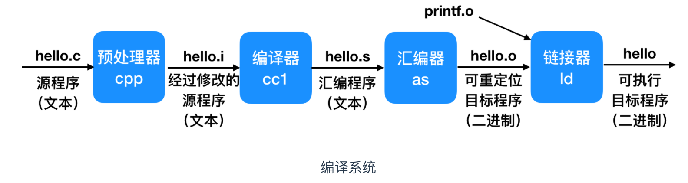

# C 语言入门（一）

::: tip 前言

考虑良久，开个新坑🧐

:::


::: info 前提须知

- 重学 C 语言
- 不是速成教程
- 个人理解为主

:::

## 一、C 语言介绍

### 1.1 C 语言简介

> C 语言可以算得上其他高级语言的鼻祖了，现代流行的高级语言都可以看到它的影子🤔

- C是一种**抽象**的、**面向过程**的编程语言，支持**结构化编程**、**词法作用域**和**递归**，使用**静态类型系统**，并且广泛用于系统软件与应用软件的开发。C 语言在计算机体系中占据着不可替代的作用，可以说 C 语言是编程的基础


- C 语言是 1972 年，由贝尔实验室的**丹尼斯·里奇(Dennis Ritch)**和**肯·汤普逊(Ken Thompson)**在开发 UNIX 操作系统时设计了C语言。C 语言是一门流行的语言，它把计算机科学理论和工程实践理论完美的融合在一起，使用户能够完成模块化的编程和设计。


- C 语言具有**高效、灵活、功能丰富、表达力强和较高的可移植性**等特点，在程序设计中备受青睐，成为最近25年使用最为广泛的编程语言。


-  C 语言的重要性


### 1.2 C 语言的特点

C 语言能够长盛不衰、广泛应用，主要原因是它有一些鲜明的特点

- 低级语言：C 语言能够直接操作硬件、管理内存、跟操作系统对话，这使得它是一种非常接近底层的语言，也就是低级语言。
- 可移植性：C 程序可以相对简单地移植到各种硬件架构和操作系统。
- 简单性：C 语言的语法相对简单，语法规则不算太多，也几乎没有语法糖。
- 灵活性：C 语言对程序员的限制很少。它假设程序员知道自己在干嘛，不会限制你做各种危险的操作，你干什么都可以，后果也由自己负责。


::: info 扩展

当代很多流行语言都是以 C 语言为基础，比如 C++、Java、C#、JavaScript 等等。学好 C 语言有助于对这些语言加深理解。

:::


### 1.3 C 程序初识

> “你好，世界！”这句经典的C语言示例展示了C作为一种通用编程语言的力量，使人们能够在全球范围内进行沟通和改进系统。😉

C 语言的源代码文件，通常以后缀名`.c`结尾。类似下面的程序，通常作为初学编程语言时的第一个程序：

```c
#include <stdio.h>
int main()
{   
    printf("hello, world\n");
    return 0;
}
```

它的作用很简单，就是在屏幕上打印一个“Hello, world!”。


### 1.4 编译过程

> 学习 “操作系统” 需重点理解🤔

C 语言是一种编译型语言，源码都是文本文件，本身无法执行。必须通过编译器，生成二进制的可执行文件，才能执行。

C 语言的编译过程包括四个步骤：



- **预处理阶段**：预处理器（cpp）根据以字符 # 开头的命令，修改原始的 C 程序。比如 `hello.c` 中的`#include <stdio.h>`命令告诉预处理器读取系统头文件 stdio.h 的内容，并把它直接插入程序文本中。结果就得到了另一个 C 程序，通常是以 `.i` 作为文件扩展名。


- **编译阶段**：编译器（cc1）将文本文件 `hello.i` 翻译成文本文件 `hello.s`，它包含一个汇编语言程序。该程序包含函数 main 的定义，定义中的每条语句都以一种文本格式描述了一条低级机器语言指令。汇编语言是非常有用的，因为它为不同高级语言的不同编译器提供了通用的输出语言。

```txt
main:
    subq $8, %rsp
    movl $.LC0, %edi
    call puts
    movl $0, %eax
    addq $8, %rsp
    ret
```


- **汇编阶段**：接下来，汇编器（as）将 `hello.s` 翻译成机器语言指令，把这些指令打包成一种叫做可重定位目标程序（relocatable object program）的格式，并将结果保存在目标文件 `hello.o` 中。`hello.o` 文件是一个二进制文件，它包含的 17 个字节是函数 main 的指令编码。如果我们在文本编辑器中打开 `hello.o`文件，将看到一堆乱码。


- **链接阶段**：请注意，`hello` 程序调用了 `printf` 函数，它是每个 C 编译器都提供的标准 C 库中的一个函数。`printf` 函数存在于一个名为 `printf.o` 的单独的预编译好了的目标文件中，而这个文件必须以某种方式合并到我们的 `hello.o` 程序中。链接器（ld）就负责处理这种合并。结果就得到 `hello` 文件，它是一个可执行目标文件（或者简称为**可执行文件**），可以被加载到内存中，由系统执行。


## 写在最后

> 之后的学习我们会一步步了解它。今天就到这里吧。🤪

敬请期待下一章
