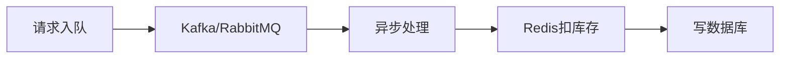

### **并发资源竞争问题的核心解决方案**

#### **1. 问题本质**
在分布式系统中，多个线程/进程同时修改共享资源（订单、库存、红包）时，因**非原子性操作**导致数据不一致，典型如超卖、重复抢单。


### **2. 解决方案分层设计**

#### **2.1 单机环境（多线程）**
- **互斥锁（Mutex）**  
  ```java
  // 伪代码示例
  ReentrantLock lock = new ReentrantLock();
  lock.lock();
  try {
      if (stock > 0 && !userBought(user)) {
          stock--;
          recordPurchase(user);
          return SUCCESS;
      }
  } finally {
      lock.unlock();
  }
  ```
  **适用场景**：单服务多线程场景，如单机秒杀系统。

#### **2.2 分布式环境**
- **数据库乐观锁**  
  ```sql
  UPDATE orders 
  SET status = 'claimed' 
  WHERE order_id = '123' 
    AND status = 'unclaimed';
  -- 通过返回影响行数判断是否成功
  ```
  **适用场景**：低频写操作，如订单状态更新。

- **Redis原子操作**  
  ```lua
  -- Lua脚本保证原子性
  local stock = redis.call('GET', KEYS[1])
  if stock > 0 then
      redis.call('DECR', KEYS[1])
      return 1
  else
      return 0
  end
  ```
  **适用场景**：高并发场景（如红包、秒杀），Redis单节点吞吐量可达10万+/秒。

- **分布式锁（Redisson）**  
  ```java
  RLock lock = redisson.getLock("order_lock");
  lock.lock();
  try {
      // 执行业务逻辑
  } finally {
      lock.unlock();
  }
  ```
  **适用场景**：复杂业务逻辑需要跨服务加锁，如外卖订单抢单。

---

### **3. 高并发场景最佳实践**
#### **3.1 三级库存校验**
1. **前端限流**：按钮置灰 + 队列缓冲（如漏斗算法）
2. **Redis预减库存**：通过`DECR`原子操作扣减
3. **数据库最终校验**：事务内检查库存和用户购买记录

#### **3.2 异步化设计**


#### **3.3 幂等性保障**
- **唯一标识**：为每个请求生成UUID，防止重复提交
- **状态机**：订单状态流转需满足`unclaimed -> claimed`，禁止非法转换

---

### **4. 方案对比**
| **方案**             | **吞吐量** | **复杂度** | **适用场景**               |
| -------------------- | ---------- | ---------- | -------------------------- |
| 数据库乐观锁         | 1k+/s      | 低         | 低频写操作                 |
| Redis原子操作        | 10万+/s    | 中         | 简单资源竞争（库存、红包） |
| 分布式锁（Redisson） | 1万+/s     | 高         | 复杂业务逻辑               |

---

### **5. 典型问题解决方案**
#### **5.1 外卖订单抢单**
```java
// 通过Redis Lua脚本实现原子操作
String luaScript = "if redis.call('GET', KEYS[1]) == 'unclaimed' then " +
                  "redis.call('SET', KEYS[1], 'claimed'); " +
                  "return 1; " +
                  "else return 0; end";
Long result = jedis.eval(luaScript, 1, "order_123");
if (result == 1) {
    // 抢单成功，发送通知
}
```

#### **5.2 秒杀系统防超卖**
```java
// 三级校验流程
public boolean seckill(String userId, String productId) {
    // 1.Redis预减库存
    Long stock = jedis.decr("stock:" + productId);
    if (stock < 0) return false;
    
    // 2.校验用户购买记录（Redis Bitmap）
    if (jedis.getbit("user:" + userId + ":bought", productId.hashCode())) {
        return false;
    }
    
    // 3.数据库事务最终校验
    try (Connection conn = dataSource.getConnection()) {
        conn.setAutoCommit(false);
        PreparedStatement checkStmt = conn.prepareStatement(
            "SELECT stock FROM products WHERE id = ? FOR UPDATE");
        ResultSet rs = checkStmt.executeQuery();
        if (rs.next() && rs.getInt("stock") > 0) {
            // 扣减库存并记录购买
            conn.commit();
            return true;
        }
        conn.rollback();
    } catch (SQLException e) {
        // 异常处理
    }
    return false;
}
```

---

### **6. 面试高频问题**
1. **为什么不用数据库悲观锁？**  
   - 表级锁影响并发性能，行级锁在高并发下仍可能死锁。

2. **Redis集群环境如何保证原子性？**  
   - 使用Redisson的`MultiLock`跨节点加锁，或通过`EVAL`执行Lua脚本。

3. **如何防止Redis和数据库数据不一致？**  
   - 采用最终一致性方案：消息队列 + 补偿机制（如定时核对脚本）。

---

### **总结**
- **简单场景**：优先使用Redis原子操作（INCR/DECR + Lua）
- **复杂业务**：结合Redisson分布式锁 + 数据库事务
- **极端高并发**：采用异步队列 + 本地缓存 + 降级熔断机制

通过分层设计和多种技术方案组合，可在保证数据一致性的同时，最大化系统吞吐量。