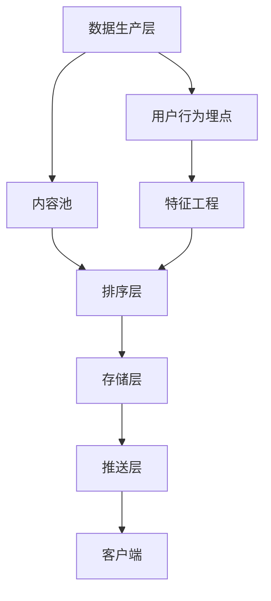

### **微博Feed流系统设计核心要素**

#### **1. Feed流类型与核心挑战**
| **类型**       | **特点**                     | **技术挑战**                     |
|----------------|------------------------------|----------------------------------|
| **Timeline**   | 严格按时间倒序展示           | 高并发读写、实时性保障           |
| **智能推荐**   | 基于用户行为动态排序         | 实时特征计算、算法模型迭代       |


### **2. 系统架构分层设计**


#### **2.1 数据生产层**
- **内容来源**：用户发博、关注的博主、话题订阅、广告投放
- **实时性**：通过Kafka/Flink处理日志，保证秒级可见

#### **2.2 排序层**
- **Timeline模式**：  
  ```sql
  SELECT * FROM feeds 
  WHERE user_id IN (SELECT following FROM user_relations WHERE user_id=?) 
  ORDER BY create_time DESC 
  LIMIT 10
  ```
- **推荐模式**：  
  - 特征：用户画像、内容标签、互动历史
  - 算法：协同过滤（UserCF/ItemCF）、深度学习（DNN/Transformer）

#### **2.3 存储层**
- **写扩散（Write Fanout）**：  
  - 用户发布内容时，同步写入所有粉丝的收件箱（适合小V）
  - **问题**：百万级粉丝时写入压力大
- **读扩散（Read Fanout）**：  
  - 用户读取时合并关注列表的内容（适合大V）
  - **优化**：通过Redis缓存高频访问内容

#### **2.4 推送层**
- **长连接推送**：WebSocket/Server-Sent Events（SSE）
- **增量更新**：仅推送最新N条Feed，避免全量传输

---

### **3. 高并发优化策略**
#### **3.1 缓存设计**
- **热点Feed缓存**：  
  ```redis
  # 缓存用户最近20条Feed
  ZADD user:1001:feed {timestamp} "feed_id:20231001"
  ZREVRANGE user:1001:feed 0 19
  ```
- **分级缓存**：  
  - L1：本地缓存（Guava Cache）
  - L2：Redis集群
  - L3：MySQL分库分表

#### **3.2 降级方案**
- **熔断机制**：Hystrix/Sentinel监控QPS
- **兜底策略**：降级为纯时间线模式或静态推荐位

---

### **4. 推荐算法演进**
| **阶段**   | **特征**                       | **算法**                    |
| ---------- | ------------------------------ | --------------------------- |
| **冷启动** | 用户无行为数据                 | 基于热门内容/地域标签       |
| **成长期** | 积累点击/停留时长数据          | LR/GBDT + 协同过滤          |
| **成熟期** | 丰富行为数据（点赞/转发/评论） | 深度学习（DIN/YouTube DNN） |

---

### **5. 典型问题解决方案**
#### **5.1 信息茧房破除**
- **多样性控制**：  
  ```python
  # 在推荐结果中插入跨领域内容
  def diversify(feeds):
      categories = set([f['category'] for f in feeds])
      if len(categories) < 3:
          feeds.extend(fetch_cross_domain_feeds())
      return feeds
  ```
- **探索机制**：  
  采用Bandit算法（如LinUCB）平衡利用与探索

#### **5.2 实时性保障**
- **增量更新管道**：  
  ```mermaid
  graph LR
  A[用户发博] --> B[Kafka]
  B --> C[实时特征计算]
  C --> D[更新推荐模型]
  D --> E[推送至在线服务]
  ```

---

### **6. 面试高频问题**
1. **如何解决大V发博时的写扩散压力？**  
   - 混合模式：大V采用读扩散，普通用户采用写扩散

2. **推荐系统如何平衡时效性与相关性？**  
   - 特征工程中加入时间衰减因子，如`score = relevance * e^(-λt)`

3. **如何评估Feed流质量？**  
   - 离线指标：AUC、准确率、覆盖率
   - 在线指标：CTR、停留时长、互动率

---

### **7. 技术选型参考**
| **组件**     | **选型建议**          | **备注**             |
| ------------ | --------------------- | -------------------- |
| **消息队列** | Kafka/Pulsar          | 保证消息顺序性       |
| **特征存储** | Redis/HBase           | 支持高并发特征读取   |
| **推荐引擎** | TensorFlow/PyTorch    | 支持复杂模型迭代     |
| **日志收集** | Flink/Spark Streaming | 实时处理用户行为日志 |

---

### **总结**
- **核心架构**：混合存储（写扩散+读扩散） + 分级缓存 + 实时推荐
- **演进路径**：从基础Timeline到智能推荐，逐步引入机器学习
- **关键指标**：QPS > 10万级，延迟 < 200ms，推荐准确率 > 65%

通过动态平衡实时性、相关性和多样性，可构建高可用、智能化的Feed流系统，支撑千万级日活用户。